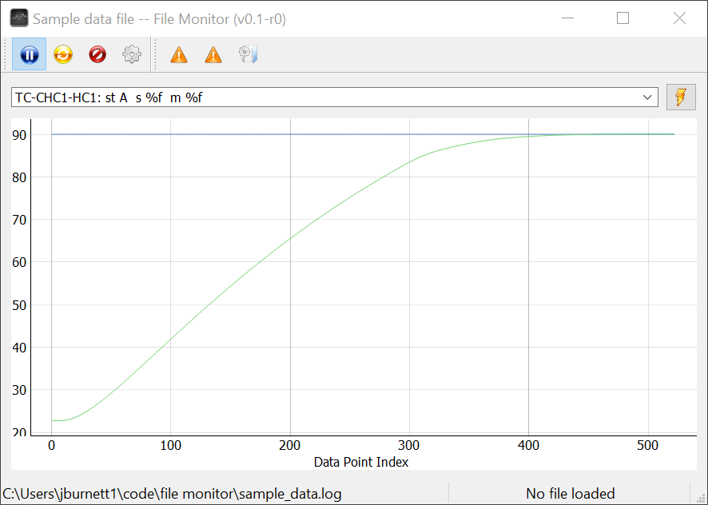

# File Monitor

A helpful utility for graphically monitoring data logged to a file, with realtime updates.

Built with [pyqtgraph](https://www.pyqtgraph.org/). Currently requires PyQt5, with possible future updates to move to pyside6.

